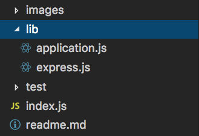

# NodeJs 实战——原生 NodeJS 轻仿 Express 框架从需求到实现（一）
---

这篇文章是一个系列的文章的第一篇，主要是自己实现一个express的简易版框架，加深对nodejs的理解。
## 确认需求

我们从一个经典的 Hello World 开始，这是 Express 官方文档的第一个实例， 代码如下

```javascript
const express = require('express');
const app = express();

app.get('/', (req, res) => res.send('Hello World!'));

app.listen(3000, () => console.log('Example app listening on port 3000!'));
```

运行 helloworld.js

```javascript
node helloworld.js
```

在浏览器上打开[http://localhost:3000](http://localhost:3000)，网页将显示 Hello World。

## 代码实现

由 Hello World 实例分析，我们可以看出 express 返回了一个函数，而执行这个函数会返回一个类的实例，实例具有 get 和 listen 两个方法。

#### 第一步，创建目录

首先我们先构建下图的目录结构



#### 第二步，创建入口文件

其中，入口为 express.js 文件，入口非常简单

```javascript
const Application = require('./application');
function express() {
  return new Application();
}
module.exports = express;
```

#### 第三步，实现应用程序类 Application

应用程序类为 application.js 文件，在这次实现中我们要达到如下要求：

- 实现 http 服务器
- 实现 get 路由请求
- 实现 http 服务器非常简单，我们可以参考 nodejs 官网的实现。

```javascript
const http = require('http');

const hostname = '127.0.0.1';
const port = 3000;

const server = http.createServer((req, res) => {
  res.statusCode = 200;
  res.setHeader('Content-Type', 'text/plain');
  res.end('Hello World\n');
});
server.listen(port, hostname, () => {
  console.log(`Server running at http://${hostname}:${port}/`);
});
```

参考该案例，实现 express 的 listen 函数。

```javascript
listen: function (port, cb) {
    var server = http.createServer(function(req, res) {
        console.log('http.createServer...');
    });
    return server.listen(port, cb);
}
```

当前 listen 函数包含了两个参数，但是 http.listen 里包含了许多重载函数，为了和 http.listen 一致，可以将函数设置为 http.listen 的代理，这样可以保持 express 的 listen 函数和 http.listen 的参数保持一致。

```javascript
listen: function (port, cb) {
    var server = http.createServer(function(req, res) {
        console.log('http.createServer...');
    });

    return server.listen.apply(server, arguments);
}
```

nodejs 后台服务器代码根据 http 请求的不同，绑定不同的逻辑。在 http 请求到服务器后，服务器根据一定的规则匹配这些 http 请求，执行与之相对应的逻辑，这个过程就是 web 服务器基本的执行流程。

对于这些 http 请求的管理，我们称之为——**路由管理**，每个 http 请求就默认为一个**路由**。
我们创建一个 router 数组用来管理所有路由映射，参考 express 框架，抽象出每个路由的基本属性：

- path 请求路径，例如：/goods。
- method 请求方法，例如：GET、POST、PUT、DELETE。
- handle 处理函数

```javascript
var router = [
  {
    path: '*',
    method: '*',
    handle: function(req, res) {
      res.writeHead(200, {
        'Content-Type': 'text/plain'
      });
    }
  }
];
```

修改 listen 方法，将 http 请求拦截逻辑修改为匹配 router 路由表，循环 router 数组里的对象，当请求方法和路径一致时，执行回调函数 handler 方法。

```javascript
listen: function(port, cb) {
    const server = http.createServer(function(req, res) {
        // 循环请求过来放入router数组的对象，当请求方法和路劲与对象一致时，执行回调handler方法
        for (var i = 1, len = router.length; i < len; i++) {
            if (
            (req.url === router[i].path || router[i].path === '*') &&
            (req.method === router[i].method || router[i].method === '*')
            ) {
            return router[i].handle && router[i].handle(req, res);
            }
        }
        return router[0].handle && router[0].handle(req, res);
    });
    return server.listen.apply(server, arguments);
}
```

实现 get 路由请求非常简单，该函数主要是添加 get 请求路由。

```javascript
get: function(path, fn) {
    router.push({
        path: path,
        method: 'get',
        handle: fn
    })
}
```

完整的代码如下：

```javascript
const http = require('http');
const url = require('url');

// 应用程序类
function Application() {
  // 用来保存路由的数组
  this.stack = [
    {
      path: '*',
      method: '*',
      handle: function(req, res) {
        res.writeHead(200, {
          'Content-Type': 'text/plain'
        });
        res.end('404');
      }
    }
  ];
}

// 在Application的原型上拓展get方法，以便Application的实例具有该方法。
Application.prototype.get = function(path, handle) {
  // 将请求路由压入栈内
  this.stack.push({
    path,
    method: 'GET',
    handle
  });
};

// 在Application的原型上拓展listen方法，以便Application的实例具有该方法。
Application.prototype.listen = function() {
  const server = http.createServer((req, res) => {
    if (!res.send) {
      // 拓展res的方法，让其支持send方法
      res.send = function(body) {
        res.writeHead(200, {
          'Content-Type': 'text/plain'
        });
        res.end(body);
      };
      
    }
    // 循环请求过来放入router数组的对象，当请求方法和路劲与对象一致时，执行回调handler方法
    for (var i = 1, len = this.stack.length; i < len; i++) {
      if (
        (req.url === this.stack[i].path || this.stack[i].path === '*') &&
        (req.method === this.stack[i].method || this.stack[i].method === '*')
      ) {
        return this.stack[i].handle && this.stack[i].handle(req, res);
      }
    }
    return this.stack[0].handle && this.stack[0].handle(req, res);
  });
  return server.listen.apply(server, arguments);
};

module.exports = Application;
```

## 总结
我们这里主要实现了express简单的搭建服务器和get请求方法的功能，满足了Hello World这个简单实例的要求。
