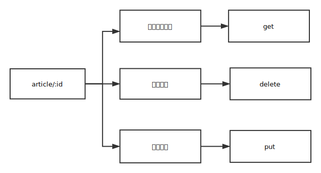

# NodeJs 实战——原生 NodeJS 轻仿 Express 框架从需求到实现（二）

---

这篇文章是一个系列的文章的第二篇，这一篇会对[上一篇](https://juejin.im/post/5bf227a751882516be2ec124)实现的简易框架进行功能拓展，并将路由与应用分离，便于代码的维护和功能拓展。为了提升路由匹配的效率，也对路由模块进行了进一步的设计。

## 确认需求

- 将路由与应用分离，便于代码的维护和功能拓展
- 优化路由模块，提升匹配效率

## Router 与 Application 分离

为了将路由与应用分离，这里我们新增一个 Router.js 文件，用来封装一个路由管理的类 Router，代码如下。

```javascript
// 路由管理类
function Application() {
  // 用来保存路由的数组
  this.stack = [
    {
      path: '*',
      method: '*',
      handle: function(req, res) {
        res.writeHead(200, {
          'Content-Type': 'text/plain'
        });
        res.end('404');
      }
    }
  ];
}

Router.prototype.get = function(path, handle) {
  // 将请求路由压入栈内
  this.stack.push({
    path,
    method: 'GET',
    handle
  });
};

Router.prototype.handle = function() {
  // 循环请求过来放入router数组的对象，当请求方法和路劲与对象一致时，执行回调handler方法
  for (var i = 1, len = this.stack.length; i < len; i++) {
    if (
      (req.url === this.stack[i].path || this.stack[i].path === '*') &&
      (req.method === this.stack[i].method || this.stack[i].method === '*')
    ) {
      return this.stack[i].handle && this.stack[i].handle(req, res);
    }
  }
  return this.stack[0].handle && this.stack[0].handle(req, res);
};
```

修改原有的 application.js 文件内容

```javascript
var Router = require('./router');
var http = require('http');

function Application() {}

Application.prototype = {
  router: new Router(),

  get: function(path, fn) {
    return this.stack.get(path, fn);
  },

  listen: function(port, cb) {
    var self = this;
    var server = http.createServer(function(req, res) {
      if (!res.send) {
        res.send = function(body) {
          res.writeHead(200, {
            'Content-Type': 'text/plain'
          });
          res.end(body);
        };
      }
      return self.router.handle(req, res);
    });
    return server.listen.apply(server, arguments);
  }
};

exports = module.exports = Application;
```

经过上面的修改，路由方面的操作只会与 Router 类本身有关，达到了与 Application 分离的目的，代码结构更加清晰，便于后续功能的拓展。

## 优化路由模块，提升匹配效率

经过上面的实现，路由系统已经可以正常运行了。但是我们深入分析一下，可以发现我们的路由匹配实现是会存在性能问题的，当路由不断增多时，this.stack 数组会不断的增大，匹配的效率会不断降低，为了解决匹配的效率问题，需要仔细分析路由的组成部分。
可以看出，一个路由是由：路径（path)、请求方式（method）和处理函数（handle)组成的。path 和 method 的关系并不是简单的一对一的关系，而是一对多的关系。如下图，所示，对于同一个请求链接，按照[RestFul API 规范](http://www.ruanyifeng.com/blog/2018/10/restful-api-best-practices.html) 可以实现如下类似的功能。

基于此，我们可以将路由按照路径来分组，分组后，匹配的效率可以显著提升。对此，我们引入层（Layer)的概念。
这里将 Router 系统中的 this.stack 数组的  每一项，代表一个 Layer。每个 Layer 内部含有三个变量。

- path，表示路由的请求路径
- handle，代表路由的处理函数(只匹配路径，请求路径一致时的处理函数)
- route，代表真正的路由，包括 method 和 handle
  整体结构如下图所示

```javascript
--------------------------------------
|        0         |        1        |
--------------------------------------
| Layer            | Layer           |
|  |- path         |  |- path        |
|  |- handle       |  |- handle      |
|  |- route        |  |- route       |
|       |- method  |       |- method |
|       |- handle  |       |- method |
--------------------------------------
            router 内部
```
#### 创建Layer类，匹配path

```javascript
function Layer(path, fn) {
  this.handle = fn;
  this.name = fn.name || '<anonumous>';
  this.path = path;
}

/**
 * Handle the request for the layer.
 *
 * @param {Request} req
 * @param {Response} res
 */
Layer.prototype.handle_request = function(req, res) {
  var fn = this.handle;
  if (fn) {
    fn(req, res);
  }
};

/**
 * Check if this route matches `path`
 *
 * @param {String} path
 * @return {Boolean}
 */
Layer.prototype.match = function(path) {
  if (path === this.path || path === '*') {
    return true;
  }
  return false;
};

module.exports = Layer;
```

修改 Router 类，让路由经过 Layer 层包装

```javascript
var Layer = require('./layer');
// 路由管理类
function Router() {
  // 用来保存路由的数组
  this.stack = [
    new Layer('*', function(req, res) {
      res.writeHead(200, {
        'Content-Type': 'text/plain'
      });
      res.end('404');
    })
  ];
}

Router.prototype.get = function(path, handle) {
  // 将请求路由压入栈内
  this.stack.push(new Layer(path, handle));
};

Router.prototype.handle = function(req, res) {
  var self = this;
  for (var i = 1, len = self.stack.length; i < len; i++) {
    if (self.stack[i].match(req.url)) {
      return self.stack[i].handle_request(req, res);
    }
  }

  return self.stack[0].handle_request(req, res);
};

module.exports = Router;
```
#### 创建Route类，匹配method
创建Route类，该类主要是在Layer层中匹配请求方式（method），执行对应的回调函数。这里只实现了get请求方式，后续版本会对这一块进行扩展。
```javascript
var Layer = require('./layer');

function Route (path) {
    this.path = path;
    this.stack = []; // 用于记录相同路径不同method的路由
    this.methods = {}; // 用于记录是否存在该请求方式
}


/**
 * Determine if the route handles a given method.
 * @private
 */
Route.prototype._handles_method = function (method) {
    var name = method.toLowerCase();
    return Boolean(this.methods[name]);
}

// 这里只实现了get方法
Route.prototype.get = function (fn) {
    var layer = new Layer('/', fn);
    layer.method = 'get';
    this.methods['get'] = true;
    this.stack.push(layer);

    return this;
}

Route.prototype.dispatch = function(req, res) {
    var self = this,
        method = req.method.toLowerCase();
    
    for(var i = 0, len = self.stack.length; i < len; i++) {
        if(method === self.stack[i].method) {
            return self.stack[i].handle_request(req, res);
        }
    }
}

module.exports = Route;
```
修改Router类，将route集成其中。
```javascript
var Layer = require('./layer');
var Route = require('./route');
// 路由管理类
function Router() {
  // 用来保存路由的数组
  this.stack = [
    new Layer('*', function(req, res) {
      res.writeHead(200, {
        'Content-Type': 'text/plain'
      });
      res.end('404');
    })
  ];
}

Router.prototype.get = function(path, handle) {
  var route = this.route(path);
  route.get(handle);
  return this;
};

Router.prototype.route = function route(path) {
  var route = new Route(path);
  var layer = new Layer(path, function(req, res) {
    route.dispatch(req, res);
  });
  layer.route = route;
  this.stack.push(layer);
  return route;
};

Router.prototype.handle = function(req, res) {
  var self = this,
    method = req.method;
  for (var i = 1, len = self.stack.length; i < len; i++) {
    if (self.stack[i].match(req.url) && self.stack[i].route && self.stack[i].route._handles_method(method)) {
      return self.stack[i].handle_request(req, res);
    }
  }

  return self.stack[0].handle_request(req, res);
};

module.exports = Router;
```
## 总结
我们这里主要是创建了一个完整的路由系统，并在原始代码基础上引入了Layer和Route两个概念。
目录结构如下
```javascript
express
  |
  |-- lib
  |    | 
  |    |-- express.js //负责实例化application对象
  |    |-- application.js //包裹app层
  |    |-- router
  |          |
  |          |-- index.js //Router类
  |          |-- layer.js //Layer类
  |          |-- route.js //Route类
  |
  |-- test
  |    |
  |    |-- index.js #测试用例
  |
  |-- index.js //框架入口
```
application代表一个应用程序，express负责实例化application对象。Router代表路由组件，负责应用程序的整个路由系统。组件内部由一个Layer数组构成，每个Layer代表一组路径相同的路由信息，具体信息存储在Route内部，每个Route内部也是Layer对象，但是Route内部的Layer和Router内部的Layer是存在一定的差异性。
- Router内部的Layer，主要包含path、route属性
- Route内部的Layer，主要包含method、handle属性
当发起一个请求时，会先扫描router内部的每一层，而处理每层的时候会先对比URI，相同则扫描route的每一项，匹配成功则返回具体的信息，没有任何匹配则返回未找到。

